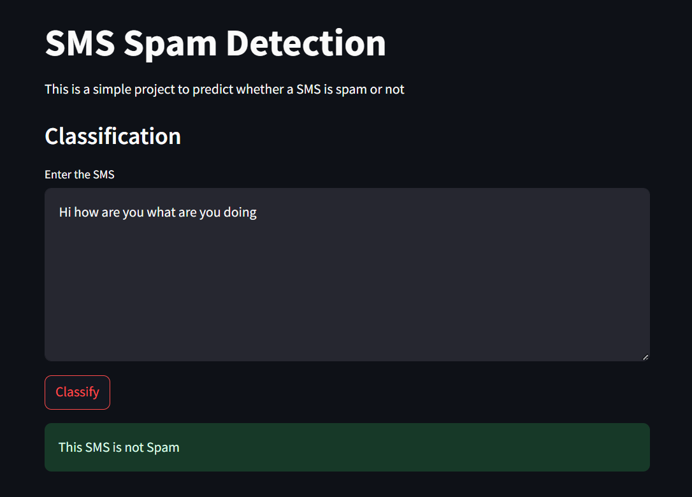

### **README.md**

# SMS Spam Detection using NLP 📨

An interactive web application for detecting spam messages using Natural Language Processing (NLP). The app preprocesses the input SMS, applies a pre-trained vectorizer, and uses a machine learning model to classify the message as **Spam** or **Not Spam**. Built with **Streamlit** for the front end.

## 💡 Features
- **Natural Language Processing (NLP):** Uses tokenization, stopword removal, and stemming for preprocessing.
- **Machine Learning Integration:** Pre-trained vectorizer and classification model for predictions.
- **User-Friendly Interface:** Intuitive web app built with Streamlit.

---

## 🖼️ Project Preview




> Add an image of your app interface in the same directory as this README file. Replace `preview.png` with the file name of your screenshot.

---

## ⚙️ Tech Stack
- **Programming Language:** Python
- **Libraries:** 
  - `nltk` for text preprocessing
  - `streamlit` for the web app
  - `pickle` for model and vectorizer loading
- **Machine Learning:** Pre-trained classification model (e.g., Logistic Regression, Naive Bayes, etc.)

---

## 🚀 How to Run the Project

### 1️⃣ Clone the Repository
```bash
git clone https://github.com/your-username/sms-spam-detection.git
cd sms-spam-detection
```

### 2️⃣ Install Required Dependencies
Install all the required Python libraries using `pip`:
```bash
pip install -r requirements.txt
```

### 3️⃣ Download NLTK Data
Ensure you have the required NLTK datasets:
```python
import nltk
nltk.download('punkt')
nltk.download('stopwords')
```

### 4️⃣ Run the Application
Start the Streamlit app:
```bash
streamlit run app.py
```

---

## 🧠 Model Training
The machine learning model was trained on an SMS Spam dataset. It includes:
- **Text Preprocessing:** Tokenization, stopword removal, and stemming.
- **Feature Extraction:** TF-IDF vectorizer for text transformation.
- **Model:** Pre-trained model serialized using `pickle`.

---

## 📂 File Structure
```
sms-spam-detection/
│
├── app.py                # Streamlit app code
├── model.pkl             # Pre-trained classification model
├── vectorizer.pkl        # Pre-trained vectorizer
├── preview.png           # App screenshot for README
├── requirements.txt      # Python dependencies
└── README.md             # Project documentation
```

---

## 🌟 Usage
1. Enter the SMS you want to classify into the text box.
2. Click the **Predict** button to see if the SMS is classified as Spam or Not Spam.
3. Results will be displayed dynamically on the app interface.

---

## 🛠️ Future Enhancements
- Support for other languages using advanced NLP libraries.
- Deployment on cloud platforms like Heroku or Streamlit Sharing.
- Enhanced UI with theme customization.

---

## 🤝 Contributing
Contributions are welcome! Please create an issue or submit a pull request for enhancements or bug fixes.

---

## 📧 Contact
For any questions or feedback, reach out to:  
**Pratiksha Waghmode**  
📧 Email: pratiksha@example.com  
📱 LinkedIn: [Pratiksha Waghmode](https://linkedin.com/in/pratiksha-waghmode)

---

### 🎯 Add Image Preview in Markdown

To add an image preview, place a screenshot of your app (e.g., `preview.png`) in the same directory as this README file. Use the following syntax to include it:

```markdown

```

You can replace `preview.png` with the file name of your image. Ensure the file is added to your repository before pushing to GitHub.

---

## 📜 License
This project is licensed under the [MIT License](LICENSE).
```
